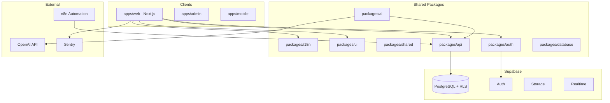

# ForgeOS — System Architecture

## High-Level Diagram



## Architectural Principles

1. **Multi-tenant first** — `tenant_id` on all tenant-scoped tables; RLS as defense in depth
2. **API-first** — REST/RPC contracts in `packages/api`; web/mobile are clients
3. **Domain-driven modules** — bounded contexts: `crm`, `inventory`, `production`, `dashboard`, `copilot`
4. **Event-driven where valuable** — stock movements, order status changes emit domain events (future: Supabase Realtime + n8n)
5. **Modular monorepo** — Turborepo + pnpm workspaces

## Repository Layout

```
forgeos/
  apps/
    web/          # Primary management UI (Next.js App Router)
    admin/        # Platform operator console (future)
    mobile/       # Shop floor / warehouse PWA (future)
  packages/
    i18n/         # Locales, keys, formatting helpers
    ui/           # shadcn-based design system
    shared/       # Types, constants, utilities
    database/     # Migrations, types, RLS policies
    auth/         # Supabase auth helpers, session
    api/          # Server actions / route handlers / client SDK
    ai/           # Copilot agent, tools (English queries)
  docs/
  scripts/
  infrastructure/
```

## Tenant Isolation Strategy

| Layer | Mechanism |
|-------|-----------|
| Database | `tenant_id` column + RLS `tenant_id = auth.jwt() ->> 'tenant_id'` |
| API | Middleware injects tenant from JWT; rejects missing tenant |
| Storage | Path prefix `{tenant_id}/` |
| AI tools | Every tool call includes `tenant_id` from session |

## Authentication Flow

1. User signs in via Supabase Auth (email/OAuth)
2. JWT custom claims: `tenant_id`, `role`, `locale` (optional override)
3. `packages/auth` provides `getSession()`, `requireTenant()`, `hasPermission()`
4. Web app Server Components fetch with cookie-based session

## AI Copilot Architecture

```
User message (any locale)
  → Language detection / user locale
  → Agent (OpenAI) with system prompt in English
  → Tool calls (English params, tenant-scoped)
  → API layer (English)
  → Response synthesis in user locale
```

Tools (Phase 1 stubs): `get_stock_level`, `list_production_orders`, `list_maintenance_alerts`, `create_maintenance_order` (future).

## Deployment

| Component | Host |
|-----------|------|
| apps/web, apps/admin | Vercel |
| PostgreSQL, Auth | Supabase |
| Automation | n8n (self-hosted or cloud) |
| Errors | Sentry |

## Technology Decisions

| Concern | Choice | Rationale |
|---------|--------|-----------|
| i18n | `next-intl` + `@forgeos/i18n` message catalogs | App Router SSR + client hydration |
| UI | Tailwind + shadcn/ui in `@forgeos/ui` | Consistent industrial dense UI |
| State (server) | React Server Components + Supabase | Minimal client JS |
| State (client) | Zustand for UI prefs (theme, sidebar, dashboard layout) | Small, explicit |
| Charts | Recharts | React-native, themeable |
| Validation | Zod in `@forgeos/shared` | Shared client/server schemas |
